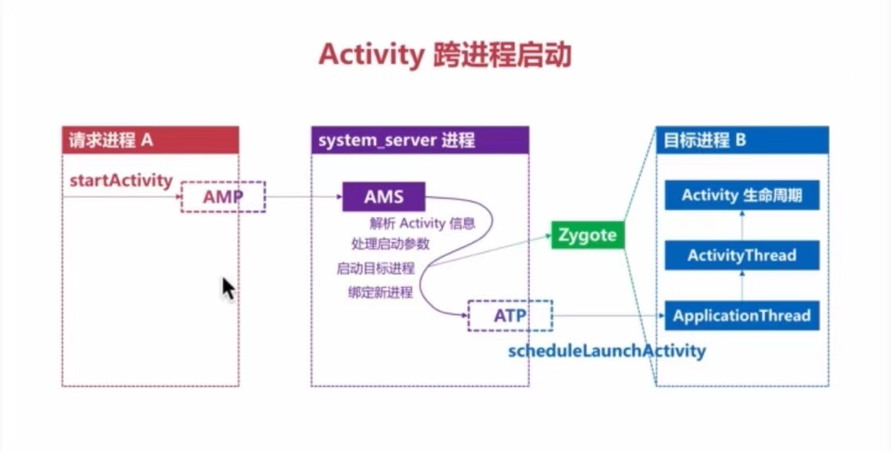
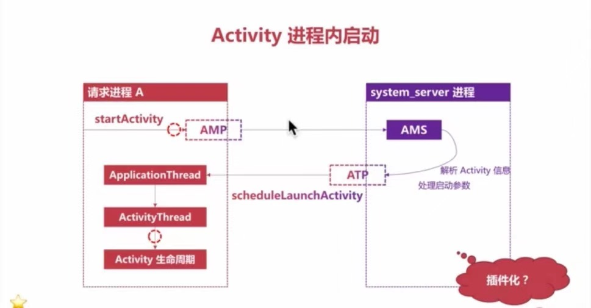

# Activity启动流程





### Activity的参数传递

1. Binder缓**冲区大小**的限制
2. 数据必须**序列化**

### Activity实例化

Q: activity不能自己实现构造函数， fragment不能添加有参数的构造函数，为什么?

### Activity能被外部应用启动的条件

* 共享uid

  ```kotlin
  // ------xml
  android:sharedUserId="com.stone">

  // -----kotlin
  startActivity(intent().setComponet(ComponentName("com.stone.app.b","com.stone.app.b.BActivity")))
  ```

* 使用exported

  ```markup
  // ------xml
  <avtivity android:name=".BActivity" android:exported="true"/>

  // -----kotlin
  startActivity(intent().setComponet(ComponentName("com.stone.app.b","com.stone.app.b.BActivity")))
  ```

* 使用intentFiler

  ```markup
  <activity android:name=".BActivity">
      <intent-filter>
          <action android:name="com.stone.intent.TEST"/>
          <category android:name="android.intent.category.DEFALUT"/>
      </intent-filter>
  </activity>

  // -----kotlin
  startActivity(Intent("com.stone.intent.TEST"))
  ```

## 为限制启动Activity添加权限

APP A ---------------------------------启动------------------------------&gt; APP B

**APP B**

```markup
<permission android:name="com.stone.b.permission"
        android:protectionLevel="signature"/>

<activity android:name=".BActivity"
          android:permission="com.stone.b.permission">
    <intent-filter>
        <action android:name="..."/>
        <category android:name="..."/>
    </intent-filter>
</activity>
```

**protectionLevel**有很多种类型: `normal`, `dangerous`, `signature`,`siguatureOrSystem`, ...

**APP A**

```markup
<uses-permission android:name="com.stone.b.permission"/>

// -----kotlin
startActivity(Intent("com.stone.intent.TEST"))
```

> TIPS:
>
> 需要注意, 在这种条件下, 需要满足`APP B`先与`APP A`安装

## 拒绝服务漏洞

存在条件

* activity的export为true
* 如果有intent-filter属性，则其对应activity的export属性默认为true

同理，静态注册的broadcast如果也存在以上漏洞片段, 所以根本原因是`getIntent()`的异常没有进行处理.

