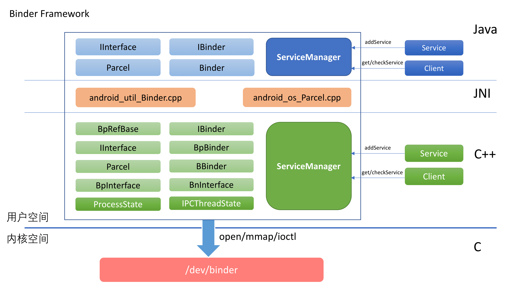
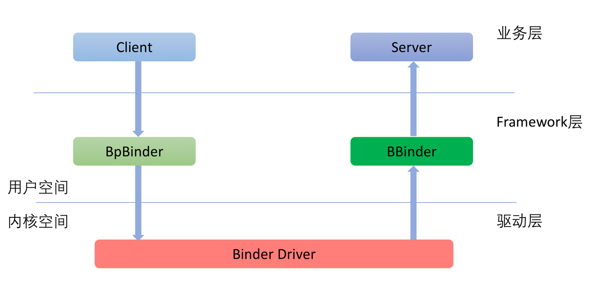
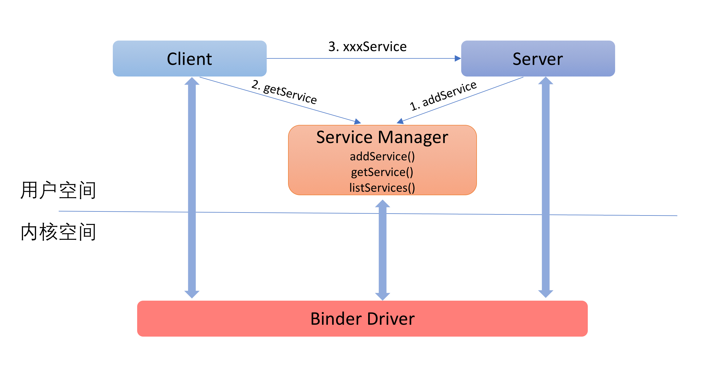

# Binder源码分析----驱动篇

\*\*\*\*[**原文地址**](https://paul.pub/android-binder-driver/#id-binder%E5%8D%8F%E8%AE%AE)\*\*\*\*

## Binder机制简介 <a id="id-binder&#x673A;&#x5236;&#x7B80;&#x4ECB;"></a>

Android系统中对于传统的IPC使用较少（但也有使用，例如：_在请求Zygote fork进程的时候使用的是Socket IPC_），大部分场景下使用的IPC都是Binder。

### 整体架构




分层: **Framework层 + 驱动层**

**Framework:**

* Java层
* JNI层
* C++层

  驱动层位于Linux内核中，它提供了最底层的数据传递，对象标识，线程管理，调用过程控制等功能。**驱动层是整个Binder机制的核心**。


既然是“进程间”通讯就至少牵涉到两个进程，Binder框架是典型的C/S架构。在下文中，我们把服务的请求方称之为Client，服务的实现方称之为Server。

Client对于Server的请求会经由Binder框架由上至下传递到内核的Binder驱动中，请求中包含了Client将要调用的命令和参数。请求到了Binder驱动之后，在确定了服务的提供方之后，会再从下至上将请求传递给具体的服务。整个调用过程如下图所示：



### 初识ServiceManager <a id="id-&#x521D;&#x8BC6;servicemanager"></a>

前面已经提到，使用Binder框架的既包括系统服务，也包括第三方应用。因此，在同一时刻，系统中会有大量的Server同时存在。那么，Client在请求Server的时候，是如果确定请求发送给哪一个Server的呢？

这个问题，就和我们现实生活中如何找到一个公司/商场，如何确定一个人/一辆车一样，解决的方法就是：每个目标对象都需要一个唯一的标识。并且，需要有一个组织来管理这个唯一的标识。

而Binder框架中负责管理这个标识的就是ServiceManager。ServiceManager对于Binder Server的管理就好比车管所对于车牌号码的的管理，派出所对于身份证号码的管理：每个公开对外提供服务的Server都需要注册到ServiceManager中（通过addService），注册的时候需要指定一个唯一的id（这个id其实就是一个字符串）。

Client要对Server发出请求，就必须知道服务端的id。Client需要先根据Server的id通过ServerManager拿到Server的标示（通过getService），然后通过这个标示与Server进行通信。

整个过程如下图所示：



## 驱动层

源码路径（这部分代码不在AOSP中，而是位于Linux内核代码中）：

```text
/kernel/drivers/android/binder.c
/kernel/include/uapi/linux/android/binder.h
```

或者

```text
/kernel/drivers/staging/android/binder.c
/kernel/drivers/staging/android/uapi/binder.h
```

