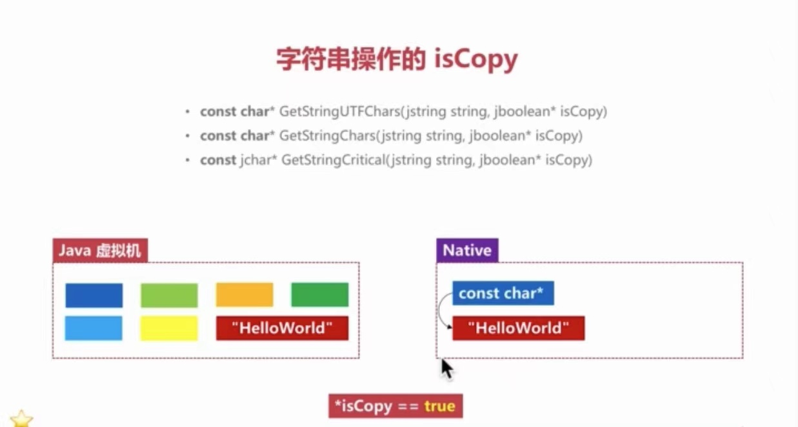
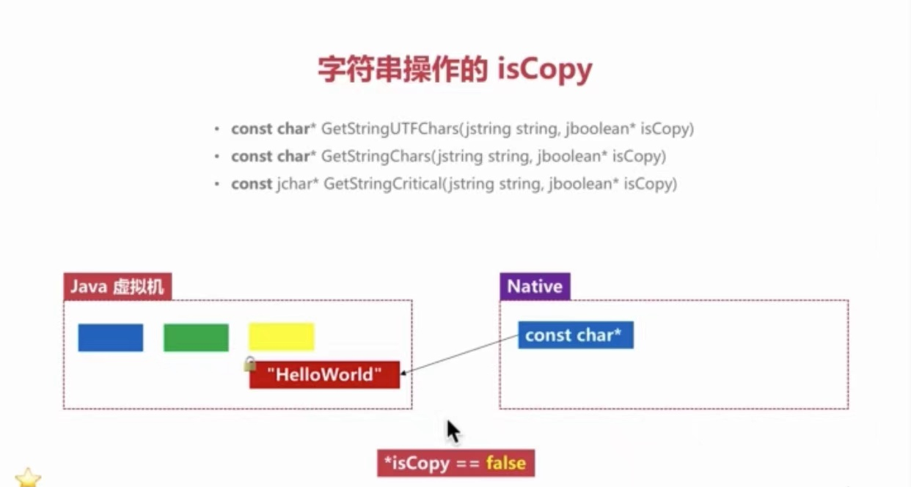

# JNI----数据传递

## 字符串操作

* GetStringUTFChars/ReleaseStringUTFChars

  ```cpp
  const char* (*GetStringUTFChars)(JNIEnv*, jstring, jboolean*);
  // 返回const char*
  // 编码格式为Modified-UTF-8
  // \0编码成0xC080, 不会影响C字符串结尾
  ```

* GetStringChars/ReleaseStringChars

  ```cpp
  const jchar* (*GetStringChars)(JNIEnv*, jstring, jboolean*);
  // 返回const jchar*
  // JNI函数自动处理字节序转换
  // java字节序是大段，c是小段，网络序是大段
  ```

* GetStringUTFRegion/GetStringRegion

  ```cpp
  void   (*GetStringUTFRegion)(JNIEnv*, jstring, jsize, jsize, char*);
  // 先在c层创建足够容量的空间
  // 将字符串的莫一部分复制到开辟好的空间
  // 针对性复制， 少量读取时效率更优
  ```

* GetStringCritical/ReleaseStringCritical

  ```text
  const jchar* (*GetStringCritical)(JNIEnv*, jstring, jboolean*);
  // 调用对中间会停掉Jvm GC --- 这个时间段不允许GC
  // 调用对之间不能有其他的JNI操作
  // 调用对可以嵌套
  ```






## 对象数组传递

> 注意点： 在设计JNI接口的时候，尽量避免传递对象，这样可以避免在jni为了操作属性而使用反射，降低性能。
>
> JNI中使用反射的方法，比如`GetDoubleField(obj,latFieldId)`

```c++
void useJObjectArray2(JNIEnv *env, jclass instance, jobjectArray objArray){
    jfieldId latFieldId = NULL, IngFieldId = NULL;
    jint length = env->GetArrayLength(objArray);
    for(int i = 0; i < length; i++){
        jobjectArray obj = env->GetObjectArrayElement(objArray, i);
        if(latFieldId == NULL){
            ...// init latFieldId & IngFieldId
        }
        jdouble lat = env->GetDoubleField(obj,latFieldId); //访问java对象，会使用到反射
        jdouble lng = env->GetDoubleField(obj,IngFieldId);
        env->DeleteLocalRef(obj); // localReference 使用需要注意数量限制（一般为：512）
        LOGD("LatLng(%f, %f)", lat, lng);
    }
}
```

## DirectBuffer

```java
// -----------java
ByteBuffer buffer = ByteBuffer.allocateDirect(100);
buffer.putInt(...);
buffer.flip();
NativeCInf.useDirectBuffer(buffer, buffer.limit());
```

```c++
// -----------c++
void*       (*GetDirectBufferAddress)(JNIEnv*, jobject);


int *bufPtr = (int*) env->GetDirectBufferAddress(buf);
for(int i = 0; i < length / sizeof(int); i++){
    LOGI("useArray: %d", bufPtr[i]); // 注意字节序
}
```