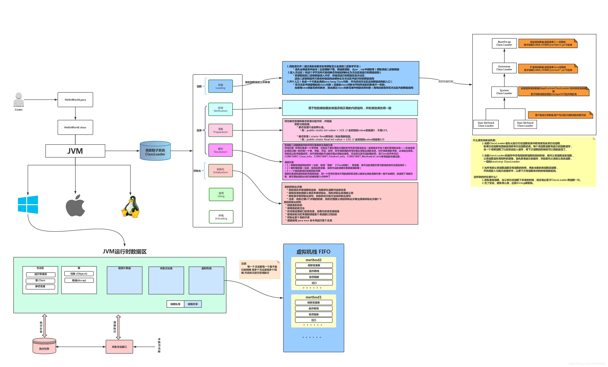

# JVM类加载全过程

**[原文地址](https://www.programmersought.com/article/77844216830/)**

When a program wants to use a class, if the class ***has not been loaded into memory***, the system will pass **class loading**, **class connection**, **class initialization**. These three steps to initialize the class.

> Sometimes these three steps are collectively referred to as **class loading** or **class initilization**.

The life cycle of a class includes the seven stages of `loading`,`validation`, `preparation`, `resolution`, `initialization`, `use`, `unloading`.

* class loading: **loading binary data**

  mainly does three things:

  * Find the class file(get the binary byte stream that defines this class by its fully qualified name)
  * Put in the method area(transform the static storage structure represented by this byte stream into the runtime data structure of the method area)
  * Open an entry(generate a `java.lang.Class` object representing this class as an entry for accessing  these data structures in the method area), 方法区可以放对象(比如: 类对象, 跟永久代对象)

* class connection

  * Verification stage: used to check whether the loaded class has the correct internal structure, and coordinate with other classes
    * File format verification: verify that the byte stream conforms to the specifications of the class file to ensure that the input byte stream can be correctly parsed and stored in the method area.
    * Metadata verification: Perform semantic analysis on the information described by the bytecode to ensure that the information described meets the specifications.
    * Bytecode verification: This stage is relatively complicated. Through data flow and control flow analysis, the method body of the class is verified to ensure the legitimacy of the program
    * Symbol reference verification: The symbol reference here not only refers to the class, but also includes the method. Occurs when the symbol reference is converted to a direct reference, that is, during the resolution phase, the information of various symbol references in the constant pool is checked for compatibility to ensure that the resolution action is performed correctly
  * Preparation stage: Allocate memory and assign values for static variables and static constants