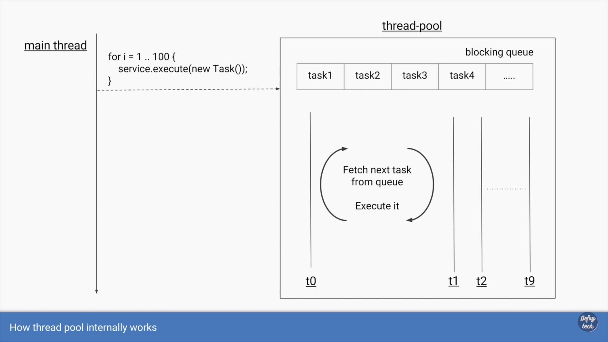
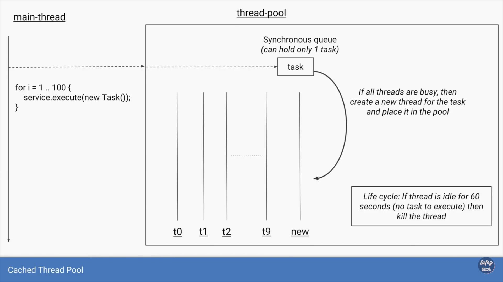
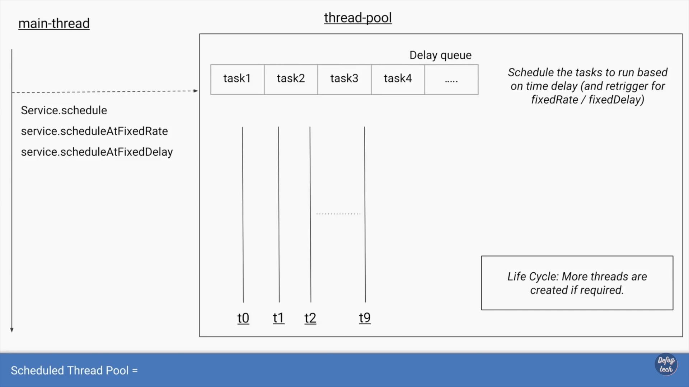
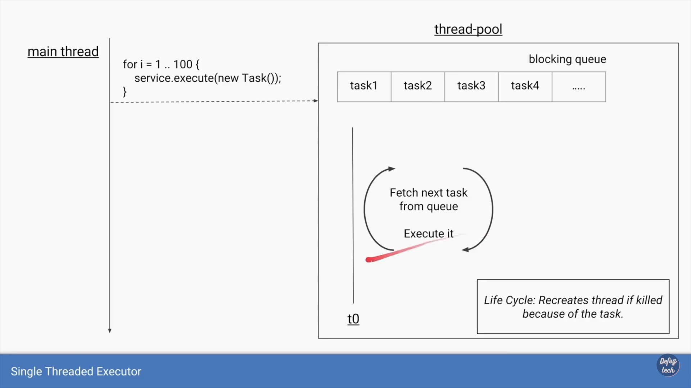
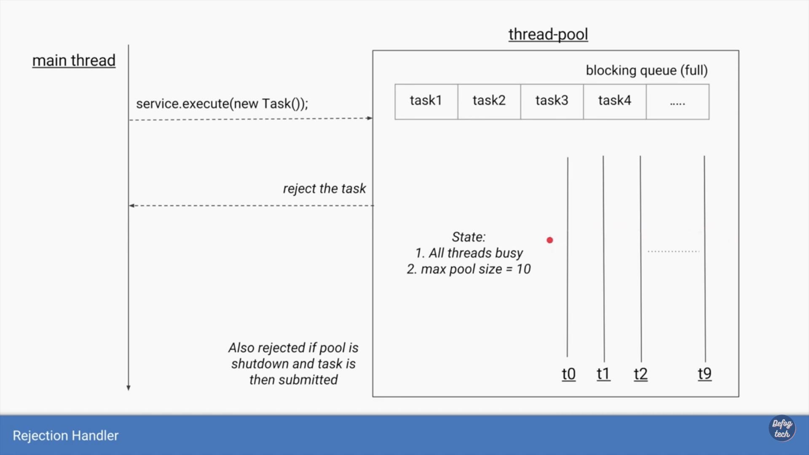
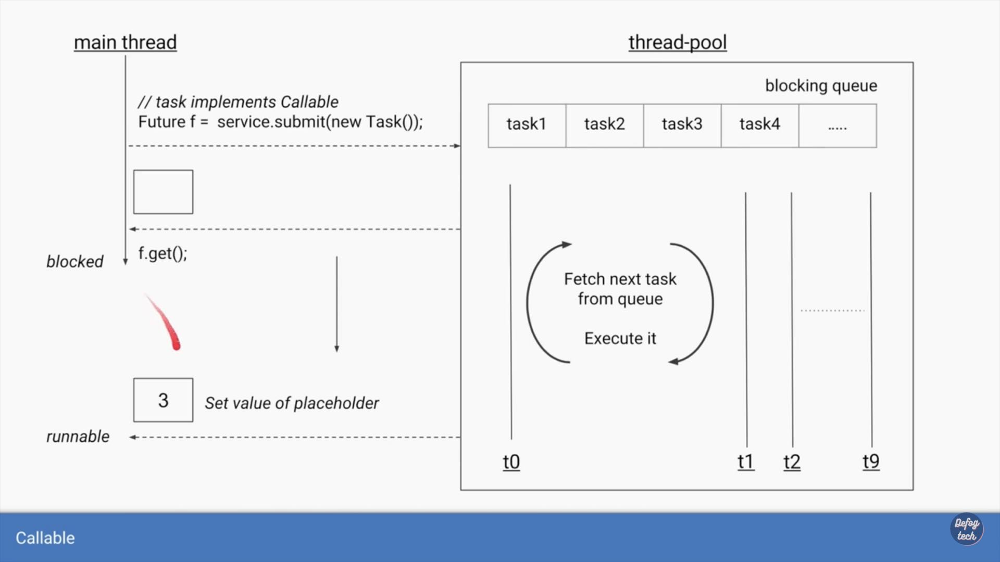

# 线程池的使用

### 线程的使用



```text
public class Main1 {
    public static void main(String[] args) {
        Thread thread = new Thread(new Task());
        thread.start();
        System.out.println("Thread name  1: " + Thread.currentThread().getName());
    }

    private static class Task implements Runnable {
        @Override
        public void run() {
            System.out.println("thread name  2: " + Thread.currentThread().getName());
        }
    }
}
```



```text
public class Main2 {
    public static void main(String[] args) {
        for (int i = 0; i < 10; i++) {
            Thread thread = new Thread(new Task());
            thread.start();
        }
        System.out.println("Main Thread name: " + Thread.currentThread().getName());
    }

    private static class Task implements Runnable {
        @Override
        public void run() {
            System.out.println("Task Thread name: " + Thread.currentThread().getName());
        }
    }
}
```



### newFixedThreadPool





```text
public class Main3 {
    public static void main(String[] args) {
        // creat the pool
        ExecutorService service = Executors.newFixedThreadPool(10);

        // submit the tasks for execution
        for (int i = 0; i < 100; i++) {
            service.execute(new Task());
        }
        System.out.println("main Thread Name: " + Thread.currentThread().getName());
    }

    private static class Task implements Runnable {
        @Override
        public void run() {
            System.out.println("Task Thread Name: " + Thread.currentThread().getName());
        }
    }
}
```



```text
public class Main4 {
    public static void main(String[] args) {

        // get count of available cores
        int coreCount = Runtime.getRuntime().availableProcessors();
        ExecutorService service = Executors.newFixedThreadPool(coreCount);

        // submit the tasks for execution
        for (int i = 0; i < 100; i++) {
            service.execute(new CpuIntensiveTask());
        }
    }

    private static class CpuIntensiveTask implements Runnable {

        @Override
        public void run() {
            // some CPU intensive operations
            System.out.println("Task Thread Name: " + Thread.currentThread().getName());
        }
    }
}
```



```text
public class Main5 {
    public static void main(String[] args) {

        // must higher count for IO Tasks
        ExecutorService service = Executors.newFixedThreadPool(100);

        // submit the tasks for execution
        for (int i = 0; i < 100; i++) {
            service.execute(new IOTask());
        }
    }

    private static class IOTask implements Runnable {

        @Override
        public void run() {
            // some IO operations which will cause thread to block/wait
        }
    }
}
```



### CachedThreadPool



```text
public class Main6 {
    public static void main(String[] args) {

        // for lot of short lived tasks
        ExecutorService service = Executors.newCachedThreadPool();

        // submit the tasks for execution
        for (int i = 0; i < 100; i++) {
            service.execute(new Task());
        }
    }

    private static class Task implements Runnable {
        @Override
        public void run() {
            System.out.println("Task Thread Name: " + Thread.currentThread().getName());
        }
    }
}
```

### ScheduledThreadPool



```text
public class Main7 {
    public static void main(String[] args) {

        // for scheduling of tasks
        ScheduledExecutorService service = Executors.newScheduledThreadPool(10);

        // task to run after 10 second delay
        service.schedule(new Task(), 10, TimeUnit.SECONDS);

        // task to run repeatedly every 10 seconds
        service.scheduleAtFixedRate(new Task(), 15, 10, TimeUnit.SECONDS);

        // task to run repeatedly 10 seconds after previous task completes
        service.scheduleWithFixedDelay(new Task(), 15, 10, TimeUnit.SECONDS);
    }

    private static class Task implements Runnable {
        @Override
        public void run() {
            // task that needs to run
            // based on schedule
            System.out.println("Task Thread Name: " + Thread.currentThread().getName());
        }
    }
}

// scheduleWithFixedDelay 最大的区别就是 ，scheduleAtFixedRate  不受任务执行时间的影响。
```


对于ScheduleAtFixedRate

当**task**的执行时间\(比如:4s\)大于**period\(2s\)**的时候, 2个task的**时间间隔**将不是period\(2s\)的值,而是任务时间执行的时间\(4s\).

如果task的执行时间\(1s\)小于**period\(2s\)**,那个2个task的时间间隔将为period的时间\(2s\).

对于ScheduleWithFixedDelay: **执行时间 + period**


### SingleThreadedExecutor




**Pool size depends on the task type**


<table>
  <thead>
    <tr>
      <th style="text-align:left"><b>Task Type</b>
      </th>
      <th style="text-align:left">Ideal pool size</th>
      <th style="text-align:left">Considerations</th>
    </tr>
  </thead>
  <tbody>
    <tr>
      <td style="text-align:left">CPU Intensive</td>
      <td style="text-align:left">CPU Core count</td>
      <td style="text-align:left">How many other applications(or other executors/threads)</td>
    </tr>
    <tr>
      <td style="text-align:left">IO Intensive</td>
      <td style="text-align:left">High</td>
      <td style="text-align:left">
        <p>Exact number will depend on rate of task submissions and</p>
        <p>average task wait time.</p>
        <p>Too many threads will increase memory consumption too.</p>
      </td>
    </tr>
  </tbody>
</table>

## 构造函数\(Constructor\)

```java
ExecutorSerivce service = Executors.newFixedThreadPool(10);

public static ExecutorService newFixedThreadPool(int nThreads){
    return new ThreadPoolExecutor(nThreads, nThreads, 
                                  0L, TimeUnit.MILLISECONDS,
                                 new LinkedBlockingQueue<Runnable>());
}

public ThreadPoolExecutor(int corePoolSize,
                         int maximumPoolSize,
                         long keepAliveTime,
                         TimeUnit unit,
                         BlockingQueue<Runnable> workQueue,
                         ThreadFacotry threadFactory,
                         RejectedExecutionHandler handler);
```

| Parameter | Type | Meaning |
| :--- | :--- | :--- |
| corePoolSize | int | Minimum/Base size of the pool |
| maxPoolSize | int | Maximum size of the pool |
| keepAliveTime + unit | long | Time to keep an idle thread alive\(after which it is killed\) |
| workQueue | BlockingQueue | Queue to store the tasks from which threads fetch them |
| threadFactory | ThreadFactory | The factory to use to create new threads |
| handler | RejectedExecutionHandler | Callback to use when tasks submitted are rejected |

| Parameter | FixedThreadPool | CacheThreadPool | ScheduledThreadPool | SingleThreadExecutor |
| :--- | :--- | :--- | :--- | :--- |
| corePoolSize | constructor-arg | 0 | constructor-arg | 1 |
| maxPoolSize | same as corePoolSize | Integer.MAX\_VALUE | Integer.MAX\_VALUE | 1 |
| keepAliveTime | 0 seconds | 60 seconds | 60 seconds | 0 seconds |


Note: Core pool threads are never killed unless `allowCoreThreadTimeOut(boolean value)` is set to true.


## Queue Type

| Pool | Queue Type | Why? |
| :--- | :--- | :--- |
| FixedThreadPool | LinkedBlockingQueue | Threads are limited, thus unbounded queue to store all tasks.  Note: Since queue can never become full, new threads are never created. |
| SingleThreadExexutor | LinkedBlockingQueue | same to FixedThreadPool |
| CacheThreadPool | SynchronousQueue | Threads are unbounded, thus no need to store the tasks.  Synchronous Queue is a queue with single slot. |
| ScheduledThreadPool | DelayedWorkQueue | Special queue that deals with schedules/time-delays |
|  |  |  |
| Custom | ArrayBlockingQueue | Bounded queue to store the tasks. if queue gets full, thread is create\(as long as count is less than maxPoolSize\) |

使用SynchronousQueue的目的就是保证“对于提交的任务，如果有空闲线程，则使用空闲线程来处理；否则新建一个线程来处理任务”。

## Rejection Policies



| Policy | What it meas? |
| :--- | :--- |
| AbortPolicy | Submitting new tasks throws RejectedExecutionException\(Runtime Exception\) |
| DiscardPolicy | Submitting new tasks silently discards it. |
| DiscardOldestPolicy | Submitting new tasks drops existing oldest task, and new task is added to the queue. |
| CallerRunsPolicy | Submitting new tasks will execute the task on the caller thread itself.  This can create feedback loop where caller thread is busy executing the task and cannot subimt new tasks at fast pace. |

自定义拒绝策略

```java
private static class CustomRejectionHandler implements RejectedExecutionHandler{
    @Override
    public void rejectedExecution(Runnable r, ThreadPoolExecutor executor){
        // logging / operations to perform on rejection
    }
}
```

```java
// initiate shutdown
service.shutdown();
// will throw RejectionExecutionException
// service.execute(new Task());
// will return true, since shutdown has begun
service.isShutdown();
// will return true if all tasks are completed
// including queued ones
service.isTerminated();
// block until all task are completed or if timeout occurs
service.awaitTermination(10, TimeUnit.SECONDS);
// will initiate shutdown and return all queued tasks
List<Runnable> runnables = service.shutdownNow();
```

### executor.get\(\)



